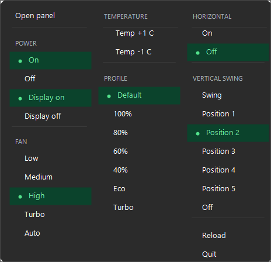
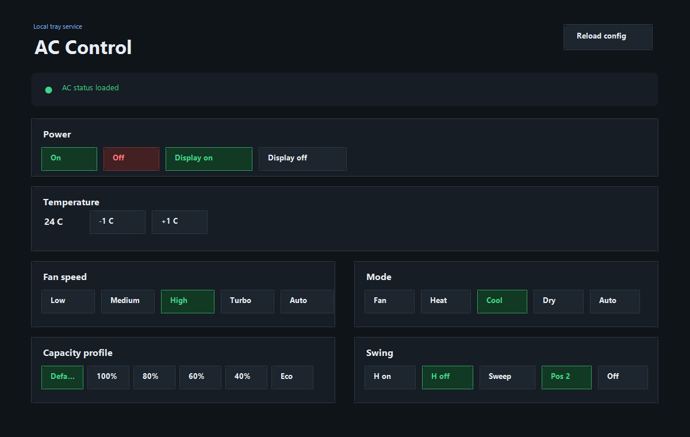

# Blue Star Smart AC Control

A lightweight Windows tray app and local web panel for controlling a Blue Star Smart AC from your laptop.

It runs a small Node.js service on `127.0.0.1:8765`, talks to your configured AC provider, and gives you two local control surfaces:

- a Windows system tray menu for quick changes
- a browser panel at `http://127.0.0.1:8765/`





## What You Can Control

- Power on/off
- Temperature up/down
- Display light on/off
- Fan speed: low, medium, high, turbo, auto
- Mode: fan, heat, cool, dry, auto
- Capacity profile: default, 100%, 80%, 60%, 40%, eco, turbo
- Horizontal swing on/off
- Vertical swing sweep, fixed positions, or off
- Config reload without restarting the tray

The web panel does not continuously poll in the background. It reads AC status when the page loads, when you press refresh, and once after each command.

## Requirements

- Windows 10 or Windows 11
- Node.js 18 or newer
- A Blue Star Smart AC account or a configured mock/local provider
- Local access to this project folder

## Quick Start

1. Install dependencies:

   ```powershell
   npm install
   ```

2. Create your environment file:

   ```powershell
   Copy-Item .env.example .env
   ```

3. Edit `.env` and add your Blue Star credentials:

   ```text
   BLUESTAR_AUTH_ID=your-phone-number
   BLUESTAR_PASSWORD=your-password
   ```

4. Review `config.json`.

   For first-run testing, the included mock provider is the safest option because it lets you open the tray and web panel without sending commands to a real AC. To control your real AC, configure the `bluestar-cloud` provider and your device values.

5. Start the local service:

   ```powershell
   npm start
   ```

6. Open the web panel:

   ```text
   http://127.0.0.1:8765/
   ```

7. Start the tray app:

   ```powershell
   npm run tray
   ```

## Using The Tray

Run `npm run tray` to show the AC controls in the Windows system tray. The tray will start the local Node service automatically if nothing is already listening on the configured port.

The tray menu includes:

- `Open panel` to open the browser UI
- power and display controls
- temperature step controls
- fan, profile, and swing controls
- `Reload` to reload `config.json`
- `Quit` to close the tray and stop the local service

Important: `Quit` is intended to stop this tool entirely. It sends `POST /api/shutdown` to the local service and then falls back to killing the tray-started process if needed.

## Start Automatically With Windows

After setup, install the startup shortcut:

```powershell
.\setup-startup.bat
```

At your next Windows sign-in, the tray app will start automatically. The tray starts the background service when needed.

To remove startup behavior later, delete the shortcut that the setup script created in your Windows Startup folder.

## Configuration

The app reads:

- `.env` for secrets
- `config.json` for host, port, devices, and provider settings
- `config.example.json` as a reference configuration

Default local address:

```json
{
  "host": "127.0.0.1",
  "port": 8765
}
```

Keep the service bound to `127.0.0.1` unless you have a specific reason to expose it. The tray and web panel are designed for local laptop use.

## Blue Star Cloud Notes

The Blue Star cloud provider uses AWS IoT MQTT over WebSocket. Typical topics are:

- normal control publish topic: `$aws/things/<thing-id>/shadow/update`
- force-sync topic: `things/<thing-id>/control`
- state topic: `things/<thing-id>/state/reported`
- AWS IoT endpoint: `a26381dl7mudo4-ats.iot.ap-south-1.amazonaws.com`
- AWS region: `ap-south-1`

Normal controls are published as AWS IoT Shadow desired state:

```json
{
  "state": {
    "desired": {
      "pow": 1,
      "ts": 1780500000000,
      "src": "anmq"
    }
  }
}
```

Current status is read by subscribing to `things/<thing-id>/state/reported` and publishing `{ "fpsh": 1 }` to `things/<thing-id>/control`.

## Local API

The service exposes these localhost endpoints:

```text
GET  /api/health
GET  /api/devices
POST /api/reload
POST /api/shutdown
GET  /api/devices/ac/status
POST /api/devices/ac/commands
```

Example command:

```json
{
  "command": "setTemperature",
  "value": 24
}
```

Supported AC commands:

- `turnOn`
- `turnOff`
- `setTemperature`
- `setFanSpeed`
- `setMode`
- `setDisplay`
- `setCapacityProfile`
- `setHorizontalSwing`
- `setVerticalSwing`

## Troubleshooting

If the web panel does not open, check that the service is running:

```powershell
npm start
```

If the tray says the service is already running, open:

```text
http://127.0.0.1:8765/api/health
```

If commands do not reach the AC, confirm your `.env` credentials and `config.json` provider settings.

Logs are written to:

- `service.log`
- `server.out.log`
- `server.err.log`

## License

Apache-2.0. See [LICENSE](LICENSE).
